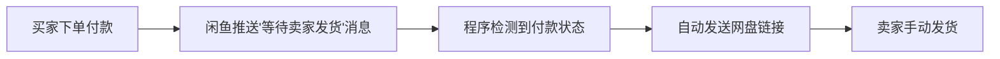

# 🐟 闲鱼自动回复系统

<div align="center">


基于 WebSocket 的闲鱼消息监听与自动回复系统，专为虚拟商品卖家设计。

[功能特性](#-核心功能) •
[快速开始](#-快速开始) •
[配置说明](#-配置说明) •
[开发指南](#-开发指南) •
[常见问题](#-常见问题)

</div>

---

## ✨ 核心功能

### 1. 自动登录与 Cookie 管理
- 使用 Playwright 自动化浏览器登录
- 自动捕获并更新有效 Cookie
- 避免频繁手动登录和 Cookie 失效问题

### 2. 智能消息监听
- 实时监听闲鱼聊天消息
- 自动识别订单状态变化
- 支持心跳保活和断线重连

### 3. 付款自动回复
- 检测到买家付款（"等待卖家发货"）时自动发送网盘链接
- 支持自定义回复内容
- 普通聊天消息不回复（可配置）

## 🚀 快速开始

### 环境要求
- Python 3.7+
- Windows/Linux/macOS

### 安装步骤

1. **克隆项目**
```bash
git clone https://github.com/IAMLZY2018/xianyuapis.git
cd xianyu
```

2. **安装 Python 依赖**
```bash
pip install -r requirements.txt
```

3. **安装 Playwright 浏览器**
```bash
playwright install chromium
```

4. **配置网盘链接**

编辑 `global_config.yml`，修改 `paid_message` 为您的网盘分享内容：

```yaml
AUTO_REPLY:
  paid_message: |
    通过百度网盘分享的文件：恢复工具.rar
    链接:https://pan.baidu.com/s/122oVO7uJpMkVE5k5SoX3bw 
    提取码:4xr5
    复制这段内容打开「百度网盘APP 即可获取」
```

### 首次使用

1. **获取登录 Cookie**
```bash
python login_helper.py
```
- 程序会打开浏览器，请扫码或短信登录
- 登录成功后会自动保存 Cookie 到 `global_config.yml`

2. **启动自动回复**
```bash
python Start.py
```

## 📋 配置说明

### `global_config.yml` 主要配置项

```yaml
AUTO_REPLY:
  enabled: true                    # 总开关
  enable_chat_reply: false         # 是否回复普通聊天（false=仅回复付款消息）
  paid_message: "您的网盘内容"      # 付款后自动发送的内容
  
  api:                             # 可选：对接外部 API
    enabled: false
    url: http://localhost:8080/xianyu/reply

COOKIES:
  last_update_time: '2026-02-03 14:19:55'
  value: 'cookie字符串...'         # 由 login_helper.py 自动更新
```

### 环境变量配置（可选）

复制 `.env.example` 为 `.env` 并配置环境变量：

```bash
cp .env.example .env
```

环境变量优先级高于配置文件，适合敏感信息管理。

## 🔧 工作流程



## 👨‍💻 开发指南

### 开发环境设置

1. **安装开发依赖**
```bash
pip install -r requirements-dev.txt
```

2. **代码格式化**
```bash
# 格式化代码
black .
isort .
```

3. **代码检查**
```bash
# 运行代码检查
flake8 .
mypy config.py utils/
```

4. **运行测试**
```bash
# 运行所有测试
pytest

# 查看测试覆盖率
pytest --cov --cov-report=html
```

### 项目结构

```
xianyu/
├── Start.py                 # 主程序入口
├── XianyuAutoAsync.py       # 核心业务逻辑
├── login_helper.py          # 登录辅助脚本
├── config.py                # 配置管理模块
├── global_config.yml        # 配置文件
├── requirements.txt         # 生产依赖
├── requirements-dev.txt     # 开发依赖
├── pyproject.toml          # 项目配置
├── .editorconfig           # 编辑器配置
├── .env.example            # 环境变量示例
├── utils/                  # 工具模块
│   ├── xianyu_utils.py     # 加密/解密工具
│   ├── ws_utils.py         # WebSocket 客户端
│   └── message_utils.py    # 消息处理工具
└── tests/                  # 测试文件
    ├── test_config.py      # 配置模块测试
    └── conftest.py         # pytest 配置
```

### 贡献代码

欢迎贡献！请查看 [CONTRIBUTING.md](CONTRIBUTING.md) 了解详细的贡献指南。

## 📝 常见问题

### Q: Cookie 失效怎么办？
**A:** 重新运行 `python login_helper.py` 获取新的 Cookie。

### Q: 如何只回复付款消息？
**A:** 确保 `global_config.yml` 中 `enable_chat_reply: false`。

### Q: 如何自定义回复内容？
**A:** 修改 `global_config.yml` 中的 `paid_message` 字段。

### Q: 程序报错 `ModuleNotFoundError`？
**A:** 运行 `pip install -r requirements.txt` 安装所有依赖。

### Q: 如何对接大语言模型？
**A:** 实现 `AUTO_REPLY.api.url` 指定的接口，返回格式：
```json
{
  "code": 200,
  "data": {
    "send_msg": "回复内容"
  }
}
```

### Q: 如何使用环境变量配置？
**A:** 复制 `.env.example` 为 `.env`，配置相应的环境变量。环境变量会覆盖配置文件中的设置。

## ⚠️ 注意事项

1. **仅供学习交流**：请勿用于违规商业用途
2. **Cookie 安全**：不要泄露 `global_config.yml` 中的 Cookie
3. **发货操作**：目前仅支持自动回复，发货需手动完成
4. **频率控制**：避免频繁操作触发闲鱼风控

## 🛠️ 技术栈

- **异步框架**: `asyncio`
- **WebSocket**: `websockets`
- **HTTP 请求**: `aiohttp`
- **浏览器自动化**: `playwright`
- **加密处理**: `blackboxprotobuf`, `execjs`
- **日志**: `loguru`
- **配置管理**: `pyyaml`, `python-dotenv`

## 📄 许可证

MIT License - 详见 [LICENSE](LICENSE) 文件

## 📝 更新日志

查看 [CHANGELOG.md](CHANGELOG.md) 了解版本更新历史。

---

**如有问题，请提交 Issue 或查看日志文件排查错误。**

⭐ 如果这个项目对您有帮助，请给个 Star！

